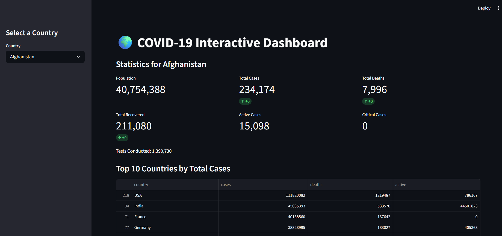

# 🌍 COVID-19 Interactive Dashboard

This is a **COVID-19 dashboard** built with **Streamlit, Pandas, and Plotly**.  
It shows current COVID-19 statistics for any country, historical trends, and top 10 countries by total and active cases.

---

## 📸 Screenshot



---

## 🚀 How to Run Locally

1. Clone the repository:

```bash
git clone https://github.com/CodeByAzriel/covid-dashboard.git
cd covid-dashboard